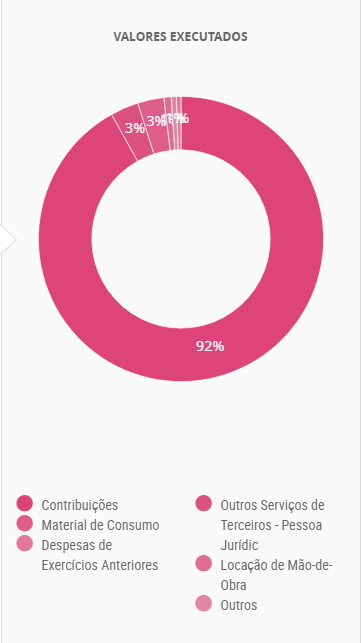

```{r setup, include=FALSE}
## **DO NOT EDIT THIS CODE CHUNK**
knitr::opts_chunk$set(echo = TRUE)

#run install.packages("cherryblossom") on the R Console to get the run17 dataset

library(tidyverse)
library(cherryblossom)  
```


## Exercise 1

```{r ex1a, out.width="80%"}
run17 %>%
  filter(event == "10 Mile") %>%
  ggplot(mapping = aes(x = age)) +
    geom_histogram(binwidth = 2)

run17 %>%
  filter(event == "10 Mile") %>%
  summarize(
    mean_age = mean(age, na.rm = TRUE),
    median_age = median(age, na.rm = TRUE),
    min_age = min(age, na.rm = TRUE),
    max_age = max(age, na.rm = TRUE)
  )
```


_The shape of the histogram skews towards the right with a peak in the age range 20-40 which suggests that the mean and median ages will be within this range. The histogram shows that ages range from early 10s to the  late 80s_


```{r ex1b, out.width="80%"}
# Write your code for Ex1b here

run17 %>%
  filter(event == "5K") %>%
  ggplot(mapping = aes(x = age)) +
    geom_histogram(binwidth = 2)

run17 %>%
  filter(event == "5K") %>%
  summarize(
    mean_age = mean(age, na.rm = TRUE),
    median_age = median(age, na.rm = TRUE),
    min_age = min(age, na.rm = TRUE),
    max_age = max(age, na.rm = TRUE)
  )

```


_The shape of the histogram skews towards the right with a peak in the age range 25-30 which suggests that the mean and median ages will be within this range. The histogram shows that ages range from early 10s to the  late 75s. When comparing the two histograms the mean_ages are similar for 10k we have 37 and for 5k we have 38, in addition to this the range of ages are also similar as the 10k dataset is between {11-85} and the 5k dataset is between {6-92} and the medians also are similar with the 10k dataset being 35 and 5k dataset being 36. _

## Exercise 2

```{r ex2, out.width = "80%"}
# Write your code to answer exercise 2a here

run17 %>%
  mutate(tm = net_sec/60) %>%
  ggplot(mapping= aes(
           x = sex ,
           y = tm,
           fill = sex
         )) +
    geom_boxplot() +
    labs(
      x= "Gender of the runner",
      y= "Time to complete the race",
      title = "race times"
    )+
  facet_wrap(~ event, scales = "free_y")

```

_From the visualization we can see that for both the 10 mile event and 5k event the for females and males have similar IQR meaning the data is spread similarly for both sexes, however the median values for the female times are greater thus on average men finish faster._


## Exercise 3

```{r ex3, out.width = "80%"}
# Write your code to answer exercise 3 here
ggplot(data = run17 %>% filter(event == "10 Mile"), 
       mapping = aes(x = clock_sec - net_sec)) + 
  geom_histogram(binwidth = 10)


first_wave <- run17 %>%
  filter(event == "10 Mile") %>%
  mutate(runners_per_wave = clock_sec - net_sec) %>%
  filter(runners_per_wave %in% (0:74))

run17 %>%
  filter(event == "10 Mile") %>%
  mutate(runners_per_wave = clock_sec - net_sec,
         waves = case_when(
           runners_per_wave %in% 0:74 ~ "First Wave",
           runners_per_wave %in% 1403:1792 ~ "Last Wave"
         )) %>%
  filter(waves == "First Wave"| waves == "Last Wave") %>%
  filter(!is.na(waves)) %>%
  ggplot(aes(x = age, y = net_sec / 60, color = waves)) +
  geom_point(alpha = 0.5, size = 1) +
  geom_smooth(method = "lm", se = FALSE) +
  scale_color_manual(values = c("First Wave" = "orange", "Last Wave" = "forestgreen")) +
  theme_bw() + 
  labs(title = "Scatter Plot of 10 Mile Race, Time Against Age",
       subtitle = "First vs Last Wave",
       x = "Runner's Age, in years",
       y = "Race Time, in minutes",
       color = NULL) +
  theme(
    legend.position = "bottom",
    legend.direction = "horizontal",
  ) +
  coord_fixed(ratio = 0.5)
```


## Exercise 4

#### Example of a good data visualisation

```{r ex4_good_viz, echo = FALSE, out.width = "80%"}
# edit the file path accordingly

```


**who**, "**who**" [Online]. Available at: **https://www.who.int/emergencies/disease-outbreak-news/item/2022-DON427** (Accessed: **31 10 2024**)


The above image presents a good data visualisation because:

-   Distinct colours for different data
-   Chooses the correct graph for the data; line for data that has a trend and barchart for data without a trend


#### Example of a bad data visualisation


```{r ex4_bad_viz, echo = FALSE, out.width = "80%"}
# edit the file path accordingly

```


**WTFViz**, "**viz**" [Online]. Available at: **https://viz.wtf/** (Accessed: **31 10 2024**)


The above image presents a bad data visualisation because:

-   Non-distinct colours are a terrible choice for representing categorical data  
-   Illegible lables that overlap for the percentages of each section of pie chart


